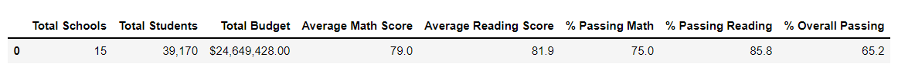

# School_District_Analysis

## Overview of Project
This project summarized data from various schools and their students' results to produce meaningful measures. Moreover, the project also aimed to adjust the result and assessed the effects of academic dishonesty of 9th graders at Thomas High School. All results were to facilitate further decision-making. 
### Purpose
This project focuses on several metrics as valuable measurements:
 - **The District Summary** summarized general information about schools and students in the district.
 - **The School Summary** summarized general information about each school in the district. 
 - **Top 5 performing schools** based on the overall passing scores.
 - **Bottom 5 performing schools** based on the overal passing scores.
 - **The average math scores by grades** summarized math scores by grades. 
 - **The average reading scores by grades** summarized reading scores by grades.
 - **The math and reading scores by school spendings** indicated the relationship between spending ranges and scores
 - **The math and reading scores by school sizes** indicated the relationship between school sizes and scores
 - **The math and reading scores by school types** indicated the relationsihp between school types and scores
## Analysis and Challenges

### The district summary

### The school summary

### Top 5 performing schools

### Top 5 bottom performing schools

### The average math scores by grades

### The average reading scores by grades

### The math and reading scores by school spendings

### The math and reading scores by school sizes

### The math and reading scores by school types

## Results

- What are two conclusions you can draw about the Outcomes based on Launch Date?

- What can you conclude about the Outcomes based on Goals?

- What are some limitations of this dataset?

- What are some other possible tables and/or graphs that we could create?
